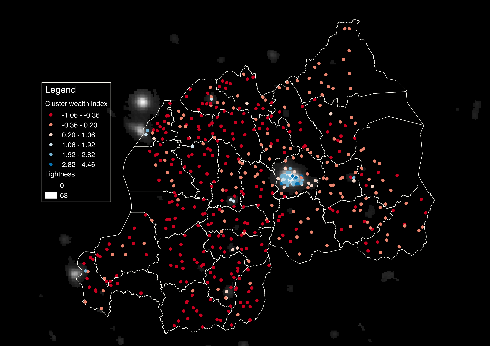
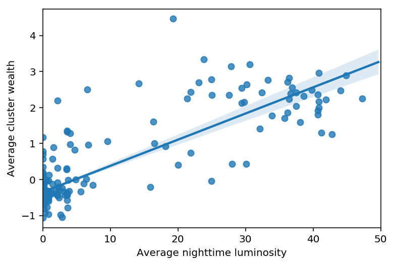
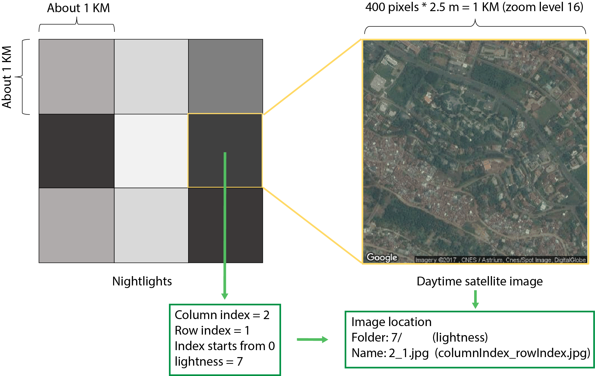
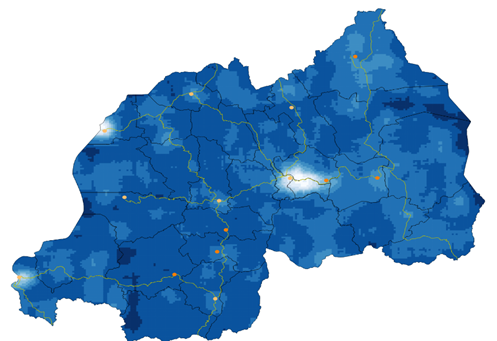

# Poverty Prediction by Combination of Satellite Imagery and Machine Learning
*Is it feasible for you to estimate the standard of living or energy consumption of a site based night-time satellite imagery？ This means whether we can do the satellite imagery processing for socioeconomic analysis?*

*Let's find out in this project!!!*

Key Steps
-------
1. Download satellite night lights images from NOAA
2. Download DHS data for Rwanda
3. Test whether night lights data can predict wealth, as observed in DHS
4. Download daytime satellite imagery from Google Maps
5. Test whether basic features of daytime imagery can predict wealth
6. Extract features from daytime imagery using deep learning libraries
7. Replicate final model and results of Jean et al (2016)
8. Construct maps showing the predicted distribution of wealth in Rwanda

A night time satellite imagery:
-----

![alt text][logo]

[logo]: https://eoimages.gsfc.nasa.gov/images/imagerecords/55000/55167/earth_lights_lrg.jpg "night time satellite imagery"

# Download nightlights images

- **RESULT**: 
 - `F182010.v4d_web.stable_lights.avg_vis.tif`: Single image file giving nightlights intensity around the world

Go to the [DMSP-OLS website](https://ngdc.noaa.gov/eog/dmsp/downloadV4composites.html) and download the satellite nighttime luminosity data (roughly 400MB). Here we are using the file F182010.v4d_web.stable_lights.avg_vis.tif.

# Download Rwandan DHS and construct cluster-level aggregates

- **FILE INPUT**: 
  - `rwanda_clusters_location.csv`: Coordinates of the centroid of each cluster
- **RESULT**: 
  - `rwanda_cluster_avg_asset_2010.csv`: Comma-delimited file indicated average wealth of each cluster 

[Demographic and Health Surveys (DHS)](http://dhsprogram.com/What-We-Do/Survey-Types/DHS.cfm) are nationally-representative household surveys that provide data for a wide range of monitoring and impact evaluation indicators in the areas of population, health, and nutrition. For this assignment, you will need to download the [2010 Rwandan DHS data](http://dhsprogram.com/what-we-do/survey/survey-display-364.cfm). **This requires registration** Do not forget to request for the GPS dataset. 

The immediate goal is to take the raw survey data, covering 12,540 households, and compute the average household wealth for each survey cluster (think of a cluster as a village). Refer to the file `Recode6_DHS_22March2013_DHSG4.pdf` for information on these data.

Saved output is `rwanda_cluster_avg_asset_2010.csv`.
NOTES:
- `Household Recode` contains all the attributes of each household. It provides datasets with different formats. We use `RWHR61FL.DAT` file in Flat ASCII data (.dat) format.
- `RWHR61FL.DCF` describes the attributes and the location of each attribute.
- Geographic Datasets: `rwge61fl.zip` contains the location of each cluster in Rwanda. It is in the format of shapefile, which needs QGIS or other GIS softwares to open. For those who are not familiar with GIS tools or who want a shortcut, you can also sue the file `rwanda_clusters_location.csv` provided.

the cluster locations, overlaid on the nightlights data, are shown in the figure below.

# Merge nightlights and DHS data at cluster level
- **INPUT**: 
 - `F182010.v4d_web.stable_lights.avg_vis.tif`: Nightlights data, from Step 1
 - `rwanda_cluster_avg_asset_2010.csv`: DHS cluster averages, from Step 2
- **OUTPUT**: Merged datasets
 - `DHS_nightlights.csv`: Merged dataset with 492 rows, and 6 columns (one indicates average cluster wealth, 5 nightlights features)
 - Scatterplot of nightlights vs. DHS wealth
 
 NOTES:
 - The resolution of each pixel in the nightlight image is about 1km. Use 10 pixels X 10 pixels to average the luminosity of each cluster.
 - Start by just taking the **Mean** of the luminosity in the 100 pixels and comparing this to cluster average wealth. I also compute other luminosity characteristics of each cluster, such as the **Max**, **Min**, **Standard Deviation** of the 100 pixel values, but this step is not required. Note that the file we provide (`DHS_nightlights.csv`) has these added features.
 - To read the raw raster (nightlights) files, we recommend using the GDAL library. Use `conda install gdal` to install the GDAL library.

 
# Download daytime satellite imagery 
- **INPUT**: 
 - Google Maps API key
 - `Sector_Boundary_2012.shp`: Rwandan shapefile
- **OUTPUT**: 
 - Thousands of satellite images (store in directory `google_image/`)

We will use the Google Static Maps API to download satellite images. Refer [Google Static Maps introduction](https://developers.google.com/maps/documentation/static-maps/intro) and [Google Static Maps API Usage Limits](https://developers.google.com/maps/documentation/static-maps/usage-limits). You must apply for an API key before downloading. 

Download the images from Google at zoom level 16 (pixel resolution is about 2.5m). Set the image size to be 400 pixels X 400 pixels, so that each image you download will cover 1 square kilometer. In this way, each daytime image you download will correspond to a single pixel from the nighttime imagery from Step 1 above.

NOTES:
 - You will need to tell Google the locations for which you wish to download images. One way to do this is to use a [shapefiles](https://en.wikipedia.org/wiki/Shapefile) that specifies the borders of Rwanda. We have provided this shapefile (`Sector_Boundary_2012.shp`) as well as a helper function to read in the shapefile.
 - The function we provide below does not limit the maximum number of images downloaded per day. Note that if you attempt to  download more than the daily limit, Google will return blank images instead of an error.
 - You can organize the files however you like. However, for later analysis (Steps 6 and beyond), it may help if you organize these daytime images into 64 folders, with one folder indicating the nightlight intensity of the pixel corresponding to the daytime image. In other words, if you download a daytime image for which the corresponding nighttime pixel has value 32, store that daytime image in a folder labeled '32'. This way, all the satellite images within each folder will have the same nightlight intensity. The file name is columnIndex_rowIndex.jpg, in which row index and column index are the index in the nightlight image (See the diagram below).
 

# Construct a high-resolution map of the distribution of predicted wealth
- **INPUT**: 
 - Model, image features (data/model/features_all_predictimage_location.csv)
- **OUTPUT**: 
 - Map ('poverty_mapping.tiff')
 
Use this model to calculate the predicted wealth of every one of your original images. Create a heatmap showing the distribution of predicted wealth in Rwanda.

